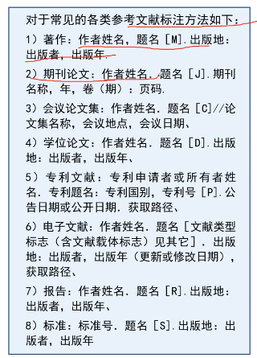

#### 模型检验

- 稳定性和敏感性分析

  - 即检验模型中某参数变化是否会引起模型输出产生变化
  - 稳定性越强，敏感性越低
  - 稳定性适用于独立的变量，例如 y=ax+b 中的 b
  - 灵敏性适用于和变量相连接的变量，例如 y=ax+b 中的 a

- 统计检验和误差分析

  - 误差<0.1，模型较好
  - 分析模型误差来源

- 新旧模型的对比
  - 结果精确度
  - 模型复杂度
  - 模型运行效率
  - 模型可推广性

#### 模型优缺点评价

- 优缺点兼有，优点充分，缺点不回避
- 常见的优点表述形式
  - 模型或思路设计的简洁使用，效率高
  - 本文建立的模型具有很强的创新型
  - 模型的计算结果准确、精度高
  - 对模型进行了各类检验、稳定性高
  - 模型本身具有的优点
- 常见缺点表述形式
  - 受 XXX 因素限制，未考虑 XXX 情况，影响精度
  - 本文考虑的因素较为理想，降低了模型的普适性和推广能力
  - 由于系统考虑了 XXX 等的因素，导致模型较为复杂，计算时间长，效率低
  - 模型本身具有的缺点

#### 参考文献

- 正文引用
  - 用方括号表示参考文献的编号，引用采用上标的方式
  - 
