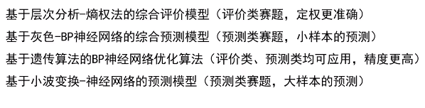
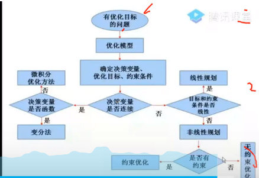

#### 评价类赛题建模以及求解过程

- 明确评价目的的建立指标体系
  - 代表性、确定性、独立性、区别能力
- 对指标体系进行规范化处理
  - 指标一致化处理，无量纲化处理
- 确定指标体系对应的权重系数
  - 主观定权法和客观定权法
- 选择或构造综合评价模型

  - 线性加权法和非线性加权法

- 预测类赛题建模与求解过程

  - 对原始数据进行预处理操作
    - 残缺值补全，异常值剔除等
  - 根据条件选择/建立合适模型
    - 中短期预测、长期预测、大/小样本
  - 对模型预测结果进行误差分析
    - 绝对误差分析、相对误差分析
  - 给出最终预测结果、回答问题
    - 给出最终结果，完成结果分析

- 优化类赛题建模以及求解过程
  - 目标函数、决策变量、约束条件
  - 
  - 
